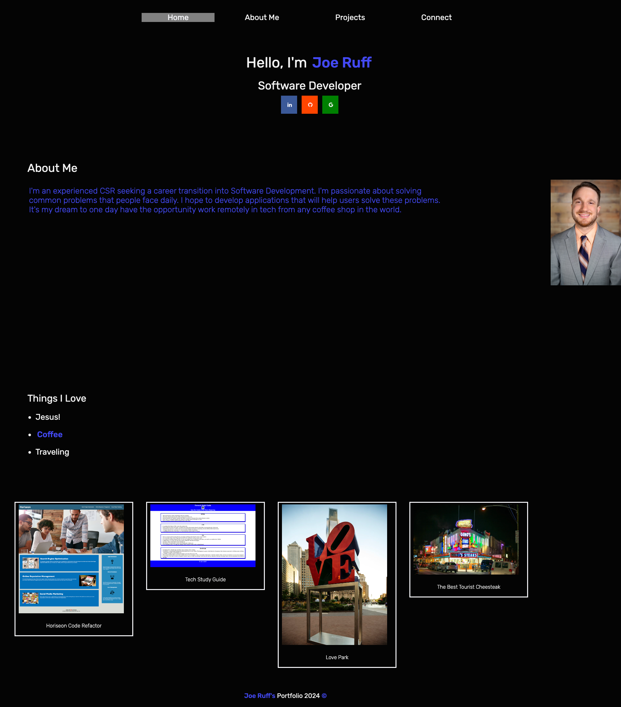

# Joe's Portfolio
=================

## Description

I developed my own portolio website that has a responsive nav bar with social media buttons, a custom google font and a display of my porfolio of projects. I only have two projects so far so I used some place holder images. Since I was born in Philadelphia, I made my portfolio a Philly theme. When you click each image it takes you to my project or the image placeholder. 

## Finished Product 

This is my completed Portfolio Project. I will continue to make updates as I grow in my knowledge of HTML, CSS, and JavaScript:

## Credits

- I used this site to help build my main top nav bar
    - **<https://www.w3schools.com/howto/howto_js_topnav.asp>**
- Utilized this resource to help with my background image
    - **<https://www.w3schools.com/cssref/pr_background-position.php>**
- Used this site as inspiration for my portfolio
    - **<https://codehalweb.com/personal-portfolio-website-html-css/>**
 - Used this image from Eater Philly
    - **<https://philly.eater.com/2016/10/13/13265012/genos-sign-racist-shake-shack-marlton-vedge-tasting-menu>**   
   

## License

MIT see more details in repo

## Live Link

<https://joegruff16.github.io/Joe.Portfolio/>

## GitHub Repo

<https://github.com/joegruff16/Joe.Portfolio>